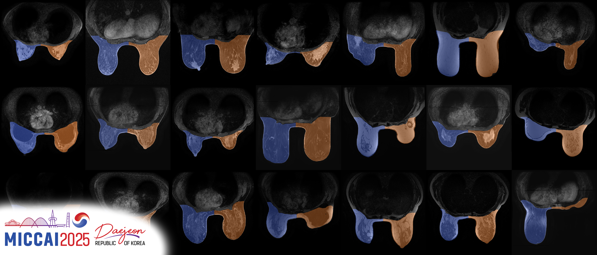

# [MICCAI 2025 WOMEN] BreastDivider: A Large-Scale Dataset and Model for Left–Right Breast MRI Segmentation


**Read the paper:**  [](https://arxiv.org/abs/2507.13830)

> **Authors**: Maximilian Rokuss\*, Benjamin Hamm\*, Yannick Kirchhoff\*, Klaus Maier-Hein  
> \*equal contribution

---


## 🧠 Introduction

**Breast MRI** plays a pivotal role in breast cancer detection, diagnosis, and treatment planning. **BreastDivider** addresses a critical limitation in breast MRI segmentation: the lack of distinction between the **left and right breasts** in most public datasets and models. 

In this work, we introduce the **first publicly available large-scale dataset with explicit left and right breast segmentation labels**, comprising **over 13,000 3D MRI scans**. Accompanying this dataset is a **robust nnU-Net–based segmentation model**, trained specifically to identify and separate left and right breast regions in clinical MRI data. This effort provides a foundation for developing high-quality, anatomically aware tools for breast MRI analysis and offers opportunities for large-scale pretraining.

🗂 This repository contains the **model only**\
📁 The dataset is available [here](https://huggingface.co/datasets/Bubenpo/BreastDividerDataset)\
🐳 A prebuilt Docker image is available on [DockerHub](https://hub.docker.com/r/ykirchhoff/breastdivider)

---

## 🧪 Model

The model is based on the [nnU-Net framework](https://github.com/MIC-DKFZ/nnUNet) and was trained on the full [BreastDivider dataset](https://huggingface.co/datasets/Bubenpo/BreastDividerDataset), using a custom configuration that allows both breasts to fit into a single 3D patch.

It generalizes well across a variety of MRI modalities, including:

 - T1-weighted (T1)
 - T1 with contrast (T1+C)
 - T2-weighted (T2)
 - FLAIR
 - Diffusion-weighted imaging (DWI)

### 🔧 How to Use

#### 🛠️ Manual Installation

 1. Install nnU-Net following the official [installation instructions](https://github.com/MIC-DKFZ/nnUNet/blob/master/documentation/installation_instructions.md).
 2. Download the model using git or the huggingface_hub (c.f. [models-downloading](https://huggingface.co/docs/hub/models-downloading))
 3. Run prediction with `nnUNetv2_predict_from_modelfolder -i input_folder -o output_folder -m /path/to/BreastDividerModel`

#### 🐳 Docker inference

You can use the prebuilt Docker container for easy deployment:\
**Pull the image:**
```
docker pull ykirchhoff/breastdivider:latest
```
**Run inference:**
```
docker run --ipc=host --rm --gpus all \
  -v "/path/to/input/folder:/mnt/input" \
  -v "/path/to/output/folder:/mnt/output" \
  ykirchhoff/breastdivider:latest
```

---

## 📄 Citation

If you use this dataset or model in your work, please cite:

```bibtex
@article{rokuss2025breastdivider,
  title     = {Divide and Conquer: A Large-Scale Dataset and Model for Left–Right Breast MRI Segmentation},
  author    = {Rokuss, Maximilian and Hamm, Benjamin and Kirchhoff, Yannick and Maier-Hein, Klaus},
  journal   = {arXiv preprint arXiv:2507.13830},
  year      = {2025}
}
```